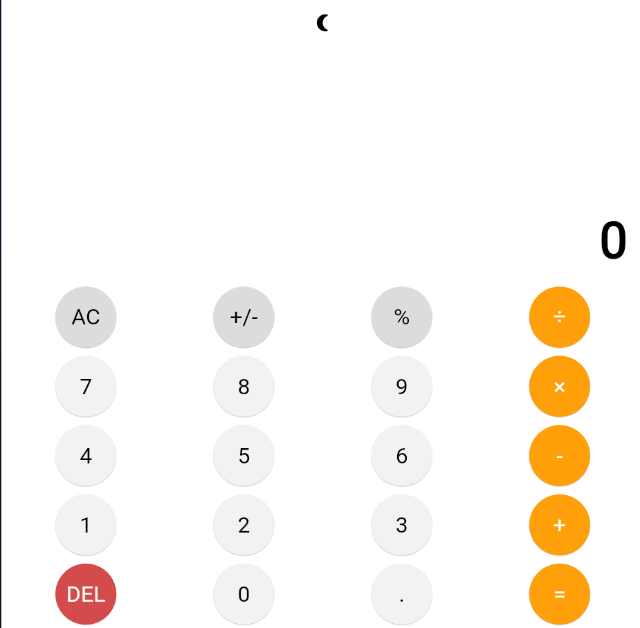
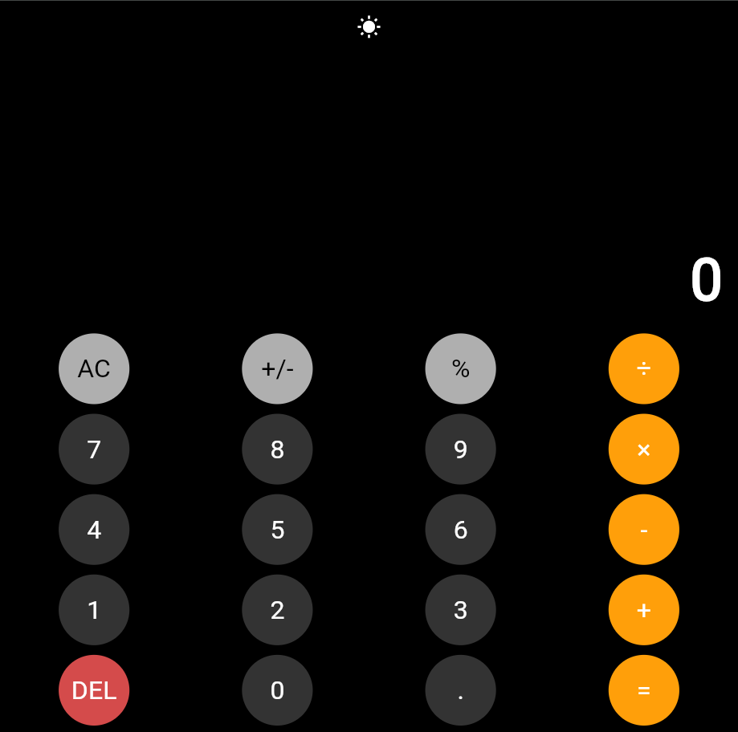

# Flutter Calculator App

A sleek, responsive calculator app built with Flutter, inspired by the iOS calculator design.

This project was built from scratch as a learning exercise, focusing on a clean UI, responsive layout, and state management in Flutter.

---

## Features

- **Standard Arithmetic:** All basic operations: addition (`+`), subtraction (`-`), multiplication (`×`), and division (`÷`) &nbsp;
- **Modern UI:** A clean, iOS-inspired design with a two-line display for expressions and results &nbsp;
- **Light/Dark Theme:** An adaptive theme that toggles between light and dark modes &nbsp;
- **Utility Functions:** Includes "All Clear" (`AC`), clear entry (`C`), percent (`%`), delete (`DEL`), and decimal (`.`) functionalities &nbsp;
- **Responsive Layout:** The UI adapts cleanly to different screen sizes

---

## Screenshots




---

## Getting Started

Follow these steps to get a local copy running.

### Prerequisites

- Flutter SDK (e.g., `3.x.x`) &nbsp;
- Dart SDK &nbsp;
- A code editor (like VS Code with the Flutter extension) &nbsp;
- An emulator (Android or iOS) or a physical device &nbsp;

---

### Installation & Setup

1.  **Clone the repository:**
    ```bash
    git clone (https://github.com/ABO0069/Module12_flutterCalculator_assign.git)
    ```

2.  **Navigate to the project directory:**
    ```bash
    cd flutter_calculator
    ```

3.  **Install dependencies:**
    ```bash
    flutter pub get
    ```

4.  **Run the app:**
    Connect a device or start an emulator, then run:
    ```bash
    flutter run
    ```

---

## How to Use

- Press the number and operator buttons to build an expression. &nbsp;
- The top line shows your full expression (e.g., `10 + 5`). &nbsp;
- The bottom line shows your current entry or the result. &nbsp;
- `AC` clears all state, while `C` just clears the current entry. &nbsp;
- `DEL` deletes the last digit of your current entry. &nbsp;
- Press the Sun/Moon icon at the top to toggle between light and dark themes. &nbsp;


